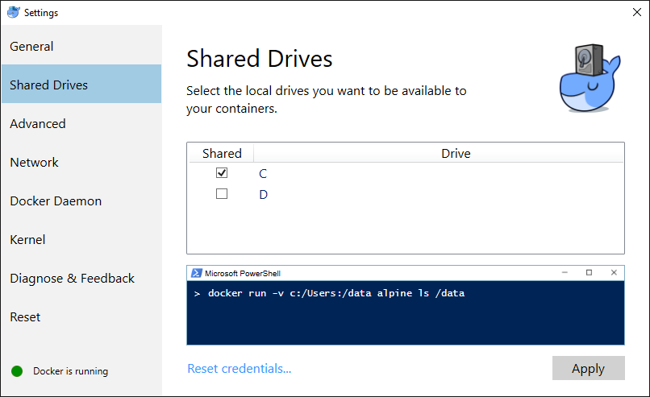

Volumes
=======

Volumes can help us develop content faster.  We create a volume for the current directory in a development container, and then we can just save and refresh without rebuilding the container.


Run a prebuilt Nginx image
--------------------------

1. `docker pull nginx:alpine`  You can learn more about this image from [Docker Hub](https://hub.docker.com/_/nginx/) and view the [Dockerfile](https://github.com/nginxinc/docker-nginx/blob/590f9ba27d6d11da346440682891bee6694245f5/mainline/alpine/Dockerfile) used to create it.

2. Create a blank folder in a conspicuous spot.  Note that you must avoid paths with dashes, and it's best to avoid paths with spaces.

3. Windows only: Right-click on the Docker system tray icon, choose Settings, go to Shared Drives, and turn on sharing for each of your drives.  This shares your host drive with the MobyLinux VM.  On Linux, there is no MobyLinux VM, and on Mac, `/Users` is already shared, so you probably don't need to do this.



4. `docker run -v /path/to/folder:/usr/share/nginx/html -p 8080:80 -d nginx:alpine` swapping out `/path/to/folder` with the folder you created in step 2.  This runs the nginx image based on the alpine linux distribution, mapping the current folder into the container, and mapping port `8080` outside the container to port `80` inside the container.  (If you're already using port 8080, choose any free port.  Browse to this port in step 2 as well.)

5. Browse to [http://localhost:8080](http://localhost:8080).  Welcome to a 404 or 403.  This is ok, it has no files to serve.


Edit files
----------

1. Create some files in this folder.  Maybe `index.html` or `foo.html` or copy in an image

2. Browse to this url.

3. Change the file(s).

4. Browse to the url(s).

With this technique, you can quickly change content without rebuilding the container.  This is a wonderful technique for development, but doesn't work well for production -- the container is empty.

Let's solve this by creating a production container:


Craft a Dockerfile
------------------

1. From the content folder you created above, create a file named `Dockerfile-prod` (no extension) and write this content:

   ```
   FROM nginx:alpine
   COPY . /usr/share/nginx/html
   ```

2. Build the dockerfile into an image:

   ```
   docker build -t nginxprod:0.1 -f Dockerfile-prod .
   ```

3. Stop the old container.  Look to module 02 for clues if necessary.

3. Run the image as a container:

   ```
   docker run -p 8080:80 -d nginxprod:0.1
   ```

We now have two Dockerfiles and two images -- one for rapid development, one for production deployment.
